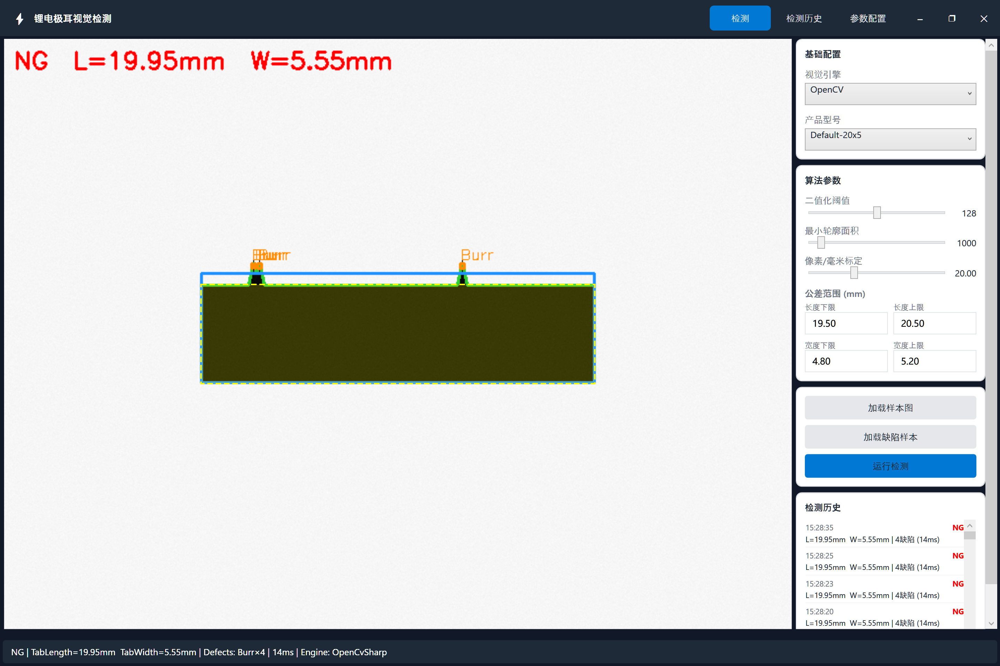
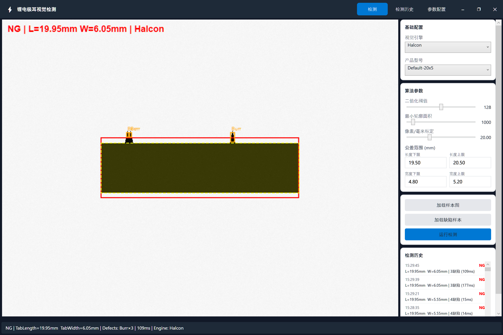
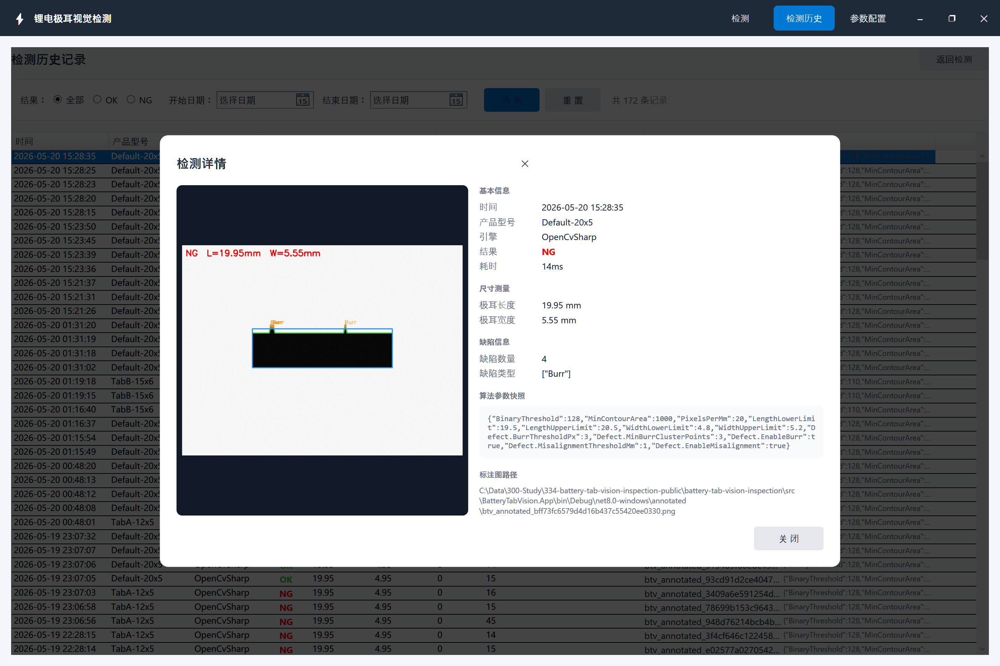
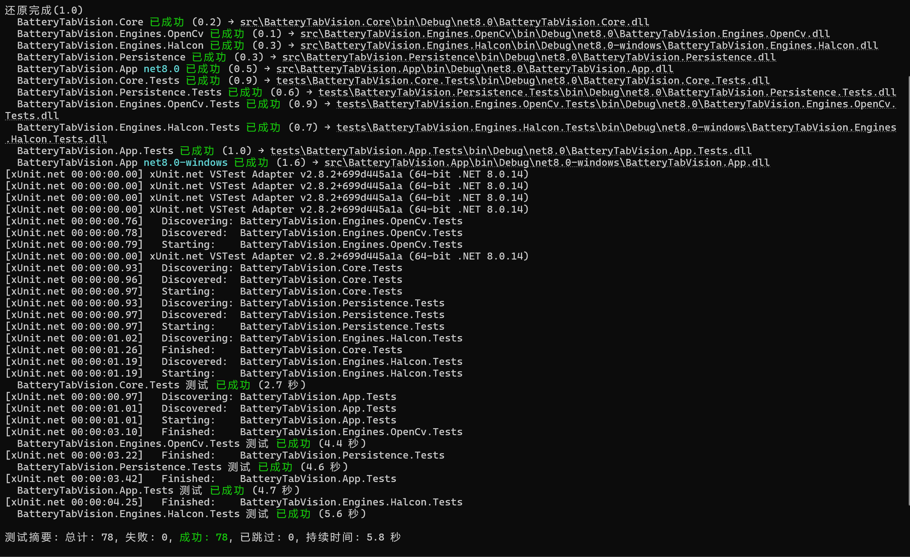

<div align="center">

# 锂电池极耳视觉检测系统

**工业级锂电极耳视觉检测上位机 · WPF / Prism 9 / OpenCvSharp · 双引擎可插拔**

为锂电后段产线设计的极耳尺寸测量与缺陷检测系统  
支持 OpenCV / Halcon 双引擎热切换 · ≤0.25% 测量精度 · 毛刺 / 错位缺陷检测

[](https://dotnet.microsoft.com/)
[](https://learn.microsoft.com/en-us/dotnet/csharp/)
[](https://github.com/PrismLibrary/Prism)
[](https://github.com/shimat/opencvsharp)
[](https://www.mvtec.com/products/halcon)
[](tests/)
[](LICENSE)

</div>

---

## 系统演示



*OpenCV 引擎：16ms 单帧检测，Burr×4 毛刺精准定位，橙色标注框 + NG 状态*

---

## 项目背景

专注于面向智能设备中后段检测工艺产线级设备，视觉检测这块一直是供应商的黑盒——相机换个型号、SDK 版本升级，就要大改代码重发版本。碰到过两次因为这类问题被迫停线等工程师的情况。自己研究了一下，发现这类系统完全可以把算法引擎做成可插拔的，所有参数外置配置，检测结果全部追溯落库，换引擎不改代码。这是按自己对工业视觉架构的理解从头实现的演示系统，持续完善中。

---

## 核心功能

| 功能              | 说明                                                   | 状态 |
| ----------------- | ------------------------------------------------------ | ---- |
| 极耳尺寸检测      | 长度 / 宽度测量，MinAreaRect 算法，误差 < 0.25%        | ✅    |
| 毛刺缺陷检测      | 大核形态学开运算参考矩形 + 轮廓偏差聚类判定            | ✅    |
| 错位缺陷检测      | 轮廓质心 vs ROI / 图像中心偏移量（mm）                 | ✅    |
| 实时参数调节      | 二值化阈值 / 轮廓面积 / 像素标定，250ms 防抖自动重检测 | ✅    |
| ROI 拖拽框选      | 鼠标拖拽圈定兴趣区，letterbox 坐标自动转换             | ✅    |
| 双引擎切换        | OpenCV / Halcon 运行时切换，无需重启                   | ✅    |
| 多产品型号配置    | JSON 配置文件按型号加载参数，操作员下拉切换            | ✅    |
| 参数可视化管理    | 产品型号参数增删改，支持上下排序，写回 JSON            | ✅    |
| 检测数据追溯      | 结果 + 参数快照 + 图像路径落库 SQLite，重启不丢失      | ✅    |
| 历史记录查询      | OK/NG 筛选 + 日期范围过滤，双击查看标注图详情          | ✅    |
| VisionMaster 引擎 | 接口预留，待接入                                       | 🔄    |
| 真机集成          | 工业相机触发 · PLC 联动 · MES 上报                     | 🔄    |

---

## 系统架构

```
BatteryTabVision.App              (WPF + Prism 9 + DryIoc · net8.0-windows)
         │
         │  IVisionAlgorithmFactory  运行时按名创建引擎实例
         ▼
┌──────────────────────────────────────────────────┐
│             算法引擎层（各自独立类库）              │
│  Engines.OpenCv   Engines.Halcon   Engines.VM   │
└────────────────────┬─────────────────────────────┘
                     │  implements IVisionAlgorithm
                     ▼
     BatteryTabVision.Core          (.NET 8 · 零第三方依赖)
     ├── IVisionAlgorithm            统一算法接口
     ├── IVisionAlgorithmFactory     引擎工厂接口
     ├── IProfileConfigService       配置服务接口
     ├── IInspectionRepository       持久化接口
     └── Models                      数据契约

     BatteryTabVision.Persistence   (FreeSql + SQLite)
```

Core 层零第三方依赖，是纯粹的契约层。算法引擎和 App 层均依赖 Core，但彼此互不依赖。切换引擎只需要下拉框选择，不改一行业务代码。

---

## 工程亮点

**1. 双引擎可插拔架构（IVisionAlgorithm + IVisionAlgorithmFactory）**

工业视觉最常见的困局是引擎绑死了，客户换需求就要改代码发版。把算法引擎做成独立类库，每个引擎实现同一个 `IVisionAlgorithm` 接口，通过 `IVisionAlgorithmFactory` 按名字创建。App 层有引擎选择下拉框，ViewModel 只调 `factory.Create(engineName)`，对上层完全透明。DryIoc 具名注册保证 DI 容器里的引擎实例按需延迟创建，没安装 Halcon 不会在启动时崩溃。目前 OpenCV 和 Halcon 均已跑通，VisionMaster 接口已预留。

> OpenCV（16ms，Burr×4）与 Halcon（112ms，Burr×3）对同一张图的检测结果略有差异——
> OpenCV 基于轮廓点偏差聚类，Halcon 基于像素级区域差集，算法本质不同，均属正常行为。



*Halcon 引擎：112ms 单帧检测，Burr×3，区域差集算法精度更高*

**2. 缺陷检测的几何本质（无需深度学习）**

极耳毛刺的定义就是"边缘超出了正常矩形轮廓"，这是一道几何问题。对二值图做大核（11×11）形态学开运算，移除毛刺后得到干净参考矩形；再把原始轮廓的点与参考矩形对比，偏离距离超过阈值且连续点数达到最小簇大小的区域，判定为毛刺。算法可以在白板上推导，参数全部外置配置，工艺工程师自己能调。错位检测同理：轮廓质心与 ROI 中心的偏移距离换算成 mm，超过阈值即判 NG。

**3. 工业可追溯架构（AlgorithmParamsJson 参数快照）**

只记录 OK/NG 不够用。6 个月后客户说这批料有问题，要能证明当时检测时用的是什么参数。每次检测结果落库 SQLite，包含尺寸测量值、缺陷信息、图像路径，以及 `AlgorithmParamsJson` 参数快照——序列化当时的完整配置。支持 OK/NG 筛选 + 日期范围查询，双击任意记录弹出详情面板，复现当时的标注图与参数现场。



*历史详情：左侧标注图 + 右侧完整元数据，缺陷类型、算法参数快照一键可查*

**4. 响应式 UI 防抖（DispatcherTimer + CancellationToken）**

用户拖动参数滑块时，每滑一格就触发 PropertyChanged。如果每次都调 OpenCV，几十次触发在队列里堆积，UI 假死。两层防御：`DispatcherTimer` 250ms 节流（停手后才真正触发），`CancellationTokenSource` 取消旧检测（新触发时取消上一次未完成的运算，最新结果赢）。最终效果是快速拖滑块 UI 流畅，松手 250ms 出结果，无排队无假死。

**5. MVVM 边界由编译器强制（双 TFM + partial class）**

ViewModel 持有 `BitmapSource`、`WriteableBitmap` 这类 WPF 类型，会导致日后迁移跨框架时 ViewModel 层大幅重写。规则很简单：ViewModel 只持有 `string`、基础值类型等跨平台类型，图像渲染留给 View 层。App 项目双 TFM（`net8.0-windows + net8.0`），WPF 专属代码隔离到 `DetectionViewModel.Windows.cs` 的 partial class 里。ViewModel 里一旦误引入 WPF 类型，`net8.0` 那条编译立刻报错——架构纪律由工具链强制执行，不依赖 code review 的运气。

---

## 快速开始

**前置条件**

- Windows 10 / 11
- .NET 8 SDK（[下载](https://dotnet.microsoft.com/download)）
- Visual Studio 2022 / JetBrains Rider

**Halcon 引擎（可选）**

安装 [MVTec HALCON](https://www.mvtec.com/products/halcon)，设置 `HALCONROOT` 环境变量。不安装时 OpenCV 引擎正常工作，Halcon 相关测试自动跳过。

**构建运行**

```bash
git clone https://github.com/Jayla630/battery-tab-vision-inspection.git
cd battery-tab-vision-inspection
dotnet build
dotnet run --project src/BatteryTabVision.App
```

**运行测试**

```bash
dotnet test
# 78 个测试（Halcon 15 个需要 HALCONROOT，未设置时自动 Skip）
```



---

## 项目结构

```
battery-tab-vision-inspection/
├── src/
│   ├── BatteryTabVision.Core/                接口 + 数据契约（零第三方依赖）
│   │   ├── Abstractions/                     IVisionAlgorithm, IVisionAlgorithmFactory
│   │   ├── Models/                           InspectionImage, InspectionResult, Measurement, Defect
│   │   └── Services/                         IProfileConfigService, IInspectionRepository
│   ├── BatteryTabVision.Engines.OpenCv/      OpenCvSharp 检测引擎
│   │   ├── OpenCvVisionAlgorithm.cs          四阶流水线 + 缺陷检测
│   │   └── Samples/                          合成极耳图像生成器（含缺陷注入）
│   ├── BatteryTabVision.Engines.Halcon/      Halcon 检测引擎
│   │   └── HalconVisionAlgorithm.cs          HalconDotNet API 完整流水线
│   ├── BatteryTabVision.Engines.VisionMaster/ 预留占位
│   ├── BatteryTabVision.Persistence/         FreeSql + SQLite 持久化层
│   └── BatteryTabVision.App/                 WPF + Prism 9 主程序
│       ├── Views/                            MainShellView, DetectionView, InspectionHistoryView
│       ├── ViewModels/                       DetectionViewModel (+ .Windows.cs)
│       ├── Infrastructure/                   VisionAlgorithmFactory, ThemeService
│       └── config/                           algorithm-profiles.json
├── tests/
│   ├── BatteryTabVision.Core.Tests/              8  个测试
│   ├── BatteryTabVision.Engines.OpenCv.Tests/   26  个测试
│   ├── BatteryTabVision.Engines.Halcon.Tests/   15  个测试（需 HALCONROOT）
│   ├── BatteryTabVision.App.Tests/              21  个测试
│   └── BatteryTabVision.Persistence.Tests/       8  个测试
├── BatteryTabVisionInspection.sln
└── .gitignore
```

---

## 路线图

- [x] Core 接口层 + 数据契约（IVisionAlgorithm · IVisionAlgorithmFactory · 零依赖）
- [x] OpenCvSharp 检测引擎（尺寸测量 + 毛刺 / 错位缺陷检测 · 78 单元测试）
- [x] Halcon 引擎接入（HalconDotNet · 正版授权 · SkippableFact 测试）
- [x] WPF + Prism 9 主程序（实时参数调节 · ROI 框选 · 双引擎切换 UI）
- [x] JSON 多产品型号配置 + 参数可视化管理（增删改 · 排序 · 写回 JSON）
- [x] SQLite 检测结果追溯（AlgorithmParamsJson 参数快照 · OK/NG 筛选 · 详情覆盖层）
- [ ] 海康 VisionMaster 引擎接入
- [ ] 真机集成（工业相机触发 · 西门子 S7 / ModbusTCP · MES 上报）

---

## License

MIT © Jayla630
